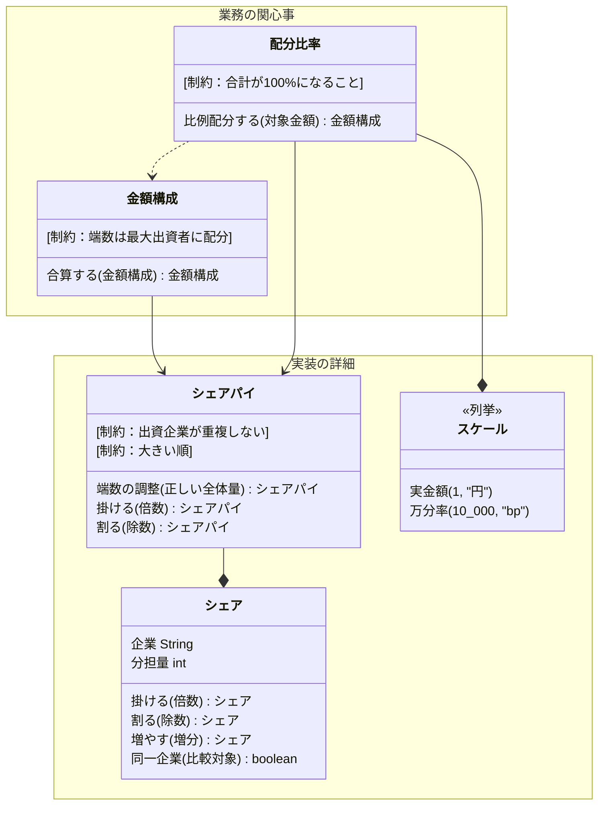

```mermaid
classDiagram
金額構成 --> シェアパイ
配分比率 --> シェアパイ
配分比率 --* スケール
配分比率 ..> 金額構成
シェアパイ --* シェア

namespace 業務の関心事 {
class 金額構成 {
[制約：端数は最大出資者に配分]
  合算する(金額構成) 金額構成
}
class 配分比率 {
[制約：合計が100%になること]
 比例配分する(対象金額) 金額構成
}
}

namespace 実装の詳細 {
class シェアパイ {
[制約：出資企業が重複しない]
[制約：大きい順]
端数の調整(正しい全体量) シェアパイ
掛ける(倍数) シェアパイ
割る(除数) シェアパイ
}

class シェア {
企業 String
分担量 int
掛ける(倍数) シェア
割る(除数) シェア
増やす(増分) シェア
同一企業(比較対象) boolean
}
class スケール {
<<列挙>>
実金額(1, "円")
万分率(10_000, "bp") 
}

}

```

```mermaid
classDiagram
    class X
```